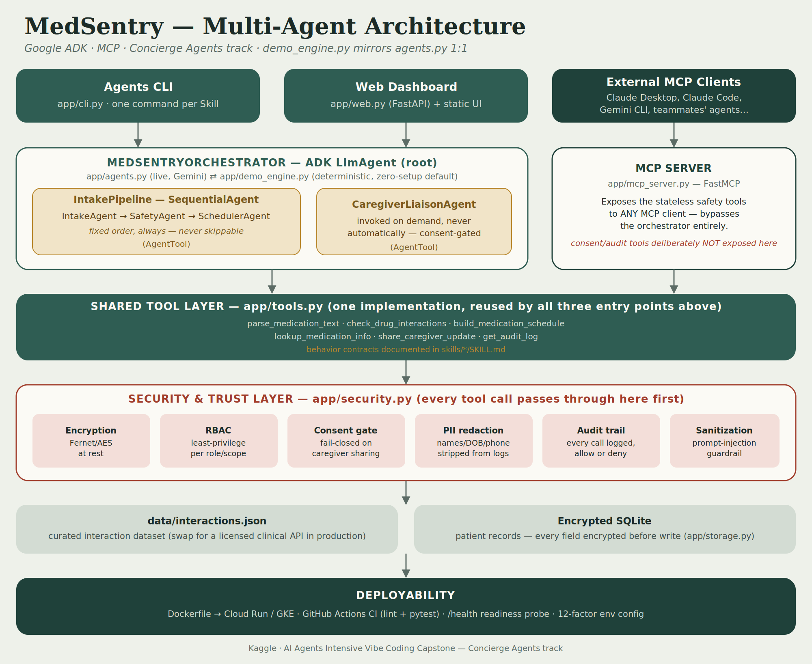

# ⚚ MedSentry — the secure family medication concierge

**Track:** Concierge Agents · Kaggle "AI Agents: Intensive Vibe Coding Capstone Project"

> A multi-agent system that checks a patient's medications for dangerous
> interactions, builds a daily dosing schedule, and shares a
> consent-filtered update with family caregivers — without ever leaking
> more than the patient explicitly allowed.



## The problem

Managing five or more prescriptions from different doctors and pharmacies
is normal for older adults and anyone with a chronic condition — and it's a
leading source of preventable harm. Nobody is structurally responsible for
checking whether the *combination* is safe, and family caregivers are
usually either shut out entirely or handed uncontrolled access to sensitive
health information. Pill-reminder apps set alarms. They don't reason about
safety, and they don't treat privacy as a design constraint rather than an
afterthought. The Concierge Agents track calls this out directly: this
track needs agents that are "safe and secure," not just convenient.

## Why agents, specifically

Four different jobs, four different trust boundaries:

- **Parsing** free-text medication lists is a data-extraction problem.
- **Safety checking** is safety-critical and must *never* be skippable or
  reorderable relative to scheduling.
- **Scheduling** is a scheduling problem.
- **Caregiver sharing** is fundamentally an access-control problem.

A single prompt handling all four has no structural way to guarantee "the
safety check always runs before the schedule is built" or "this role never
sees that field" — those become properties of prompt wording, which is a
suggestion, not a guarantee. MedSentry splits these into five agents with
distinct, least-privilege tool access (see `docs/SPEC.md`), so the
*system* enforces the ordering and the boundary, not the model's mood.

## Architecture

```
Agents CLI ──┐                                  External MCP Clients
Web Dashboard┼──► MedSentryOrchestrator (ADK)    (Claude Desktop, Claude Code…)
             │      ├─ IntakePipeline (SequentialAgent)      │
             │      │    Intake → Safety → Scheduler          ▼
             │      └─ CaregiverLiaisonAgent (AgentTool)  MCP Server (FastMCP)
             │                    │                            │
             └────────────────────┴─────────────┬──────────────┘
                                                 ▼
                              Shared Tool Layer — app/tools.py
                                                 ▼
                     Security & Trust Layer — app/security.py
                     (encryption · RBAC · consent · redaction · audit · sanitization)
                                                 ▼
                data/interactions.json  +  Encrypted SQLite (app/storage.py)
```

Full diagram: `docs/architecture.png`. Full rationale: `docs/SPEC.md`.

**Two runners, one implementation.** `app/agents.py` (live Gemini via ADK)
and `app/demo_engine.py` (deterministic, offline) both call the *exact same*
functions in `app/tools.py`. Nothing about correctness or security is
different between "demo" and "live" — only whether an LLM or a fixed
routine decides which tool to call next. This is what lets this repo run
completely, end-to-end, with zero setup.

## The six course concepts, and where to find them

| Concept | Where | Details |
|---|---|---|
| **Agent / Multi-agent system (ADK)** | `app/agents.py` | 5 agents: `IntakeAgent`, `SafetyAgent`, `SchedulerAgent` (in a `SequentialAgent` pipeline), `CaregiverLiaisonAgent`, and the `MedSentryOrchestrator` root, which calls the pipeline and the liaison as `AgentTool`s so it stays in the loop for multi-step requests. |
| **MCP Server** | `app/mcp_server.py` | Wraps the stateless safety tools with FastMCP so any MCP client (Claude Desktop, Claude Code, Gemini CLI…) can use them — see "Use it from Claude Desktop" below. |
| **Security features** | `app/security.py` | Encryption at rest, least-privilege RBAC, fail-closed consent gating, PII redaction, a full audit trail, and a prompt-injection input guardrail. See "Security, concretely" below. |
| **Deployability** | `Dockerfile`, `docker-compose.yml`, `deploy/cloudrun.sh`, `.github/workflows/ci.yml` | One-command local run, one-command Cloud Run deploy, CI on every push, `/health` probe. |
| **Agent skills (Agents CLI)** | `app/cli.py` + `skills/*/SKILL.md` | Each CLI command maps 1:1 to a persistent skill definition — see "Agent Skills" below. |
| **Antigravity** | — | See the honesty note at the very bottom of this README. |

Only 3 of 6 are required by the rules — this project covers 5 solidly.

## Quickstart (zero configuration)

```bash
git clone <this-repo-url>
cd medsentry
pip install -r requirements.txt   # google-adk is optional for the demo path
python -m app.cli run             # full pipeline demo, no API key needed
```

You should see a safety flag (the demo patient is on `warfarin` + `ibuprofen`
— a real, major interaction), a schedule, a caregiver-share result, and an
audit log — all from one command, with zero configuration.

Try the dashboard:

```bash
python -m app.cli serve
# open http://localhost:8080
```

Or with Docker:

```bash
docker compose up --build
```

### Get a real public URL (free, no credit card, ~3 minutes)

This repo includes `render.yaml`, so deployment is one click:

1. Push this repo to a public GitHub repo.
2. Go to [dashboard.render.com](https://dashboard.render.com) → sign up free with GitHub (no card needed) → **New** → **Blueprint** → select this repo.
3. Render reads `render.yaml` automatically and deploys the Dockerfile in demo mode.
4. You get a public URL like `https://medsentry.onrender.com` — use this in your demo video instead of `localhost`.

Free-tier note: the service sleeps after 15 minutes of inactivity and takes
30–60 seconds to wake back up on the next request — open the URL a minute
before you start recording so it's already warm.

### Try the CLI's skills directly

```bash
python -m app.cli skills                          # list every Agent Skill
python -m app.cli check-safety                     # safety + schedule for the demo patient
python -m app.cli add-med "warfarin 5mg at night, aspirin 81mg daily"
python -m app.cli share-update                     # consent-filtered caregiver update
python -m app.cli audit-log --as-role patient       # allowed
python -m app.cli audit-log --as-role caregiver     # denied — RBAC working as designed
```

### Run the tests

```bash
pytest tests/ -v      # 27 tests, all offline — no API key required
```

### Go live with Gemini

```bash
cp .env.example .env
# edit .env: set GOOGLE_API_KEY and MEDSENTRY_DEMO_MODE=false
pip install google-adk
python -m app.cli serve
```

## Security, concretely (not just claimed)

Every mechanism below is exercised by `tests/test_security.py` and
`tests/test_tools.py` — this is not aspirational documentation:

- **Encryption at rest.** Every patient record is Fernet/AES-encrypted
  before it's written to SQLite. We verified this directly: `strings` on
  the raw `.db` file turns up zero plaintext patient data.
- **Least-privilege RBAC.** A fixed allow-list (`_SCOPE_MATRIX` in
  `app/security.py`) maps role → permitted data scopes. Anything not
  listed is denied by default (fail-closed), not just hidden in the UI.
  `python -m app.cli audit-log --as-role caregiver` demonstrates a real
  denial.
- **Consent-gated sharing.** `share_caregiver_update` only ever includes a
  scope the patient has explicitly set to `true`. A missing key is treated
  as *not* consented — never as "not yet asked, so allowed."
- **PII redaction.** Names, dates of birth, and phone-like numbers are
  stripped by regex before anything reaches a log file or the audit trail.
- **Full audit trail.** Every tool call — allowed or denied — is recorded
  with actor role, action, scope, and outcome.
- **Input sanitization.** Free-text medication input is checked for
  prompt-injection phrasing ("ignore previous instructions," etc.) and
  rejected before it reaches any LLM reasoning step.
- **Supply-chain hygiene.** `requirements.txt` pins exact, verified
  versions — see `docs/SPEC.md` for why this matters for AI-assisted repos
  specifically ("slopsquatting").

## Use it from Claude Desktop / Claude Code (MCP)

```json
{
  "mcpServers": {
    "medsentry": {
      "command": "python",
      "args": ["-m", "app.mcp_server"],
      "cwd": "/absolute/path/to/medsentry"
    }
  }
}
```

Restart the client, then ask it something like *"use medsentry to check
whether warfarin and ibuprofen are safe together."* The consent- and
audit-bearing tools (`share_caregiver_update`, `get_audit_log`) are
deliberately **not** exposed over MCP — see the comment in
`app/mcp_server.py` for why.

## Agent Skills

Each capability is documented as a persistent skill under `skills/*/SKILL.md`
— a "when to use this / behavior contract / example" file, in the same
format the course's Day 3 module teaches. `app/cli.py`'s `skills` command
reads these files directly, so the CLI's surface and its documentation can
never quietly drift apart.

```bash
python -m app.cli skills
```

## Deploying it for real

```bash
export GCP_PROJECT=your-project-id
./deploy/cloudrun.sh
```

Deploys in demo mode by default (no secrets needed). The script prints the
follow-up commands to switch to live Gemini mode via Secret Manager —
never by editing source. See `.github/workflows/ci.yml` for the CI that
runs the full test suite and a CLI smoke test on every push.

## Project structure

```
app/
  config.py       settings (env-driven, no hardcoded secrets)
  security.py     encryption · RBAC · consent · redaction · audit · sanitization
  tools.py        the 6 tool functions — single source of truth
  agents.py       ADK multi-agent definitions (live mode)
  demo_engine.py  deterministic mirror of agents.py (default, zero-setup)
  storage.py      encrypted SQLite persistence
  mcp_server.py   FastMCP server exposing the safety tools externally
  cli.py          Agents CLI (Typer)
  web.py          FastAPI dashboard backend
skills/*/SKILL.md persistent Agent Skill definitions
static/           dashboard UI (vanilla HTML/CSS/JS, no build step)
data/             curated interaction dataset + fictional demo patient
tests/            27 tests, fully offline
docs/             architecture diagram, spec, cover image
deploy/           Cloud Run deployment script
```

## Disclaimer

MedSentry is an educational decision-support demo, not a medical device and
not medical advice. The interaction dataset is a small curated sample for
demonstration — a real deployment should call a licensed clinical
interaction API. Always confirm medication changes with a pharmacist or
physician.

## A note on honesty (Antigravity)

The course's video rubric asks for a glimpse of Google's Antigravity
agentic IDE. This repo was built collaboratively with Claude in a
sandboxed coding environment, not inside Antigravity, so we're not going to
claim otherwise in the writeup or video — only 3 of the 6 concepts are
required, and this project solidly covers 5. If you have Antigravity
installed, a genuine 15-second clip of opening this repo there and asking
it to extend a skill would legitimately cover the 6th box too.
